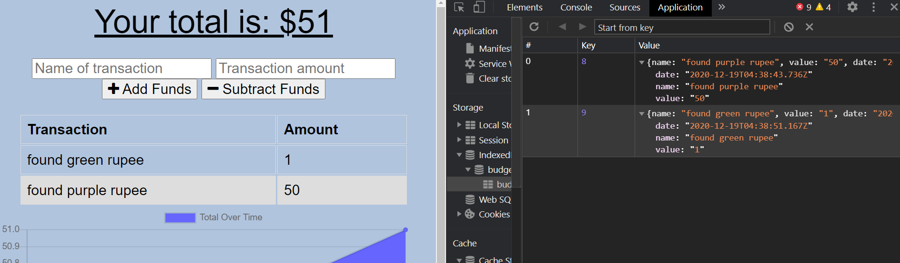
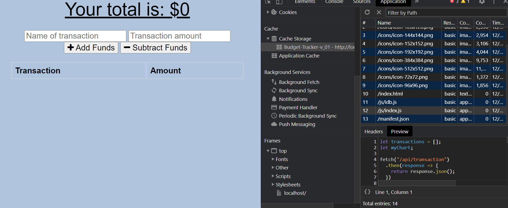
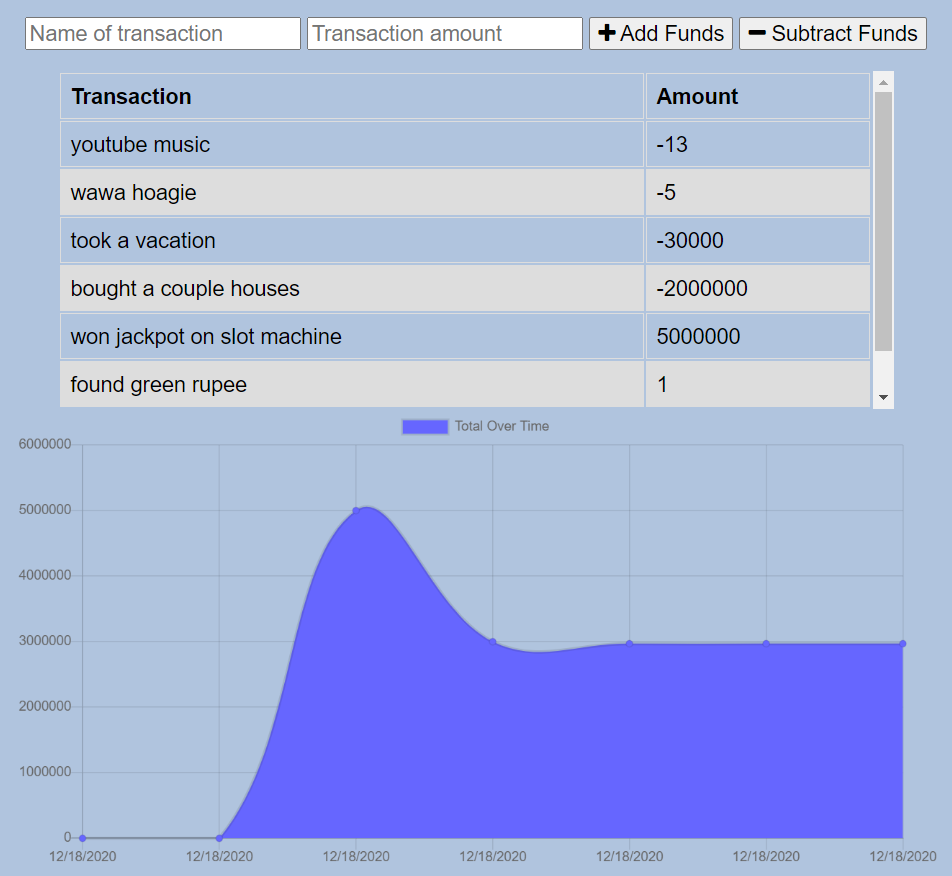

# Budget Tracker - PWA

     

  ## Description
  Budget Tracking App PWA

 #### Offline Entries using IndexedDB:
 

 #### Offline Functionality using Cached Assets:

#### Online App with All Entries:

  ## Table of Contents
  - [Installation](#installation)
  - [Tech Used](#tech-used)
  - [Questions](#questions)
  - [Links](#links)
  - [License](#license) 
  
  ## Installation
  - Both Node.js and MongoDB must be installed on your computer.
  - Clone the repo by copying and pasting in your command line: 
    - `git clone git@github.com:tchestnut85/code-zone.git`
  - Navigate to the root directory and run: 
    - `npm install`
  - To start the server, run the following in your command line: 
    - `npm run watch`
  - Navigate to `localhost:3001` in your browser to open the app locally.

  ## Tech Used
  
  

  
  
  
  

  
  ## Questions
  Please visit my **[GitHub profile](https://github.com/tchestnut85/)** to check out this and other projects I've created and contributed to.
  If you have any specific questions about this project, please contact me at <tchestnut85@gmail.com>.

  ## Links
  - **[Deployed App]()**
  - **[GitHub Repo](https://github.com/tchestnut85/budget-tracker/)**
  - **[My Portfolio](https://tchestnut85.github.io/)**
  - **[Connect on LinkedIn](https://www.linkedin.com/in/thomas-chestnut)**

  ## License  
      
  This app is licensed under the MIT license.
